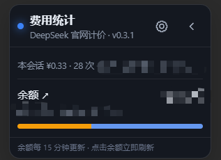
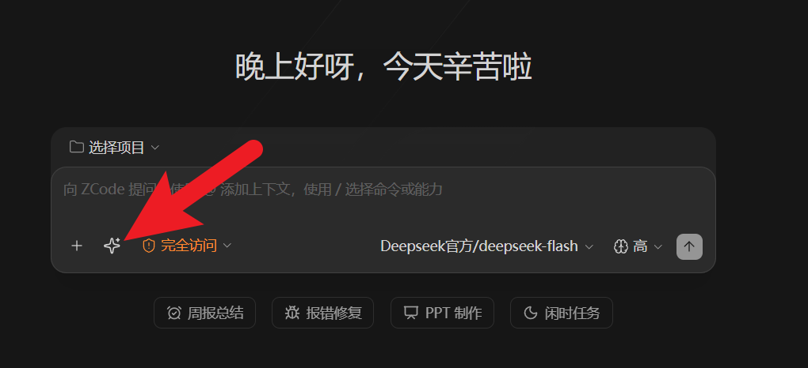

# ZCode 会话费用统计

一个面向 ZCode Desktop 的**非侵入式**会话费用侧栏：常驻窗口右侧，实时统计当前会话、今日、
本月与累计费用，并按模型拆分。通过 Chrome DevTools Protocol 注入界面，不修改 `app.asar`、
安装目录或应用签名；同时附带一键提示词增强按钮。

## 界面

侧栏有三种形态：展开的费用面板、折叠后的窄条，以及输入框里的提示词增强按钮。

### 展开态 —— 费用面板



- **标题栏**：状态圆点 + 「费用统计」，副标题显示当前计价口径与版本号；右上角齿轮进设置，
  `‹` 折叠为窄条。
- **本会话**：费用与调用次数，右侧是 token 明细（未缓存输入 / 缓存读取 / 输出）。
- **余额**：账户余额与三段进度条，每 15 分钟自动刷新；点击余额可立即刷新。
- **设置**：全部内联在侧栏内 —— Provider 与模型价格、刷新频率、峰谷倍率、本月预算。

页面刷新或新开窗口后会自动重新注入，无需手动干预。

### 折叠态 —— 窄条


折叠后只保留一行：左侧 `峰` / `谷` 标签显示当前计价时段，右侧显示今日费用，点箭头展开回
完整面板。适合长时间盯会话、又不想让侧栏占宽度的场景。

### 提示词增强按钮



图中红箭头所指的 ✨ 按钮位于输入框左下角、模型选择器左侧。点击把当前草稿交给本地控制器做
一次模型增强，结果回填输入框并可一键撤销；右键打开增强设置面板。凭据只发往你配置的
Provider 端点，不驻留页面。

## 功能

- 常驻右侧栏，可折叠为窄条；页面刷新或新窗口会自动重新注入。
- 实时统计当前会话（可含子任务）、今日、本月和累计费用。
- 展示输入、缓存读取、未缓存输入、输出 token、缓存命中率和调用次数。
- 按模型拆分费用；未知模型明确标成“未定价”，不会臆造费用。
- 本月预算与进度预警。
- 侧栏内编辑 Provider/模型价格、刷新频率、峰时倍率和预算。
- 只读 `~/.zcode/cli/db/db.sqlite` 中的 `model_usage` / `session` 表，不读取 `credentials.json` 或 API Key。

## 计费口径

价格单位是“每百万 token”。默认预置 DeepSeek V4 Flash / Pro 人民币官方价；工作日北京时间 09:00–12:00、14:00–18:00 默认使用 2 倍峰时倍率，周末默认按谷时。第三方 Provider 使用同名模型时只是官方价估算，应在设置中按实际渠道账单覆盖。

ZCode 的 `input_tokens` 已包含缓存 token，因此插件按以下方式避免重复计费：

```text
未缓存输入 = input_tokens - cache_read_input_tokens - cache_creation_input_tokens
费用 = 未缓存输入 × 输入价 + 缓存读取 × 缓存价 + 缓存写入 × 输入价 + 输出 × 输出价
```

## 安装与使用

要求 Node.js 22.5+（本机验证于 Node 22 / Node 24）。没有构建步骤，也不需要安装依赖。

1. 运行 `create-desktop-shortcut.bat`，它会在桌面创建“ZCode 增强版（费用+提示词）”快捷方式；
2. 或者直接双击本目录下的 `launcher.vbs`。

两种方式都由 `launcher.vbs` 调起 `orchestrator.mjs`，再由后者拉起 `enhance/controller.mjs` 与本目录的 `controller.mjs`。原版 ZCode 快捷方式不受影响。

如果原版 ZCode 已运行，启动器会明确询问是否重启；拒绝时不会关闭任何进程。CDP 端口仅绑定 `127.0.0.1`，默认从 9361 开始，冲突时在 9361–9375 内顺延。

### 路径解析

程序不写死任何安装路径，复制到其他电脑即可运行。`zcode-cost-meter-config.json` 里的 `zcodePath` 与 `dbPath` **留空（`""`）即自动探测**：

- `zcodePath` 按「环境变量 → 程序所在目录逐级向上 → 各盘符 `\zcode\` → 标准安装位置 → PATH」顺序查找，Windows 标准位置含 `%ProgramFiles%\ZCode`、`%ProgramFiles(x86)%\ZCode`、`%LOCALAPPDATA%\Programs\ZCode`；
- `dbPath` 默认取 `%USERPROFILE%\.zcode\cli\db\db.sqlite`（即 `~/.zcode/...`）。

也可以用环境变量覆写：

| 变量 | 作用 |
|---|---|
| `ZCODE_COST_METER_ZCODE` | 直接指定 ZCode 可执行文件，优先级最高 |
| `ZCODE_HOME` | 指定 ZCode 数据目录，默认 `~/.zcode` |
| `ZCODE_COST_METER_NODE` | 指定 node.exe，供 `launcher.vbs` 与 `start-debug.cmd` 使用 |
| `ZCODE_ENHANCER_ZCODE_PATH` | 覆写 `enhance/enhancer-config.json` 的 `zcodePath` |
| `ZCODE_ENHANCER_PORT` | 覆写提示词增强器的 CDP 调试端口（默认 9333） |

配置文件中也支持 `~`、`%USERPROFILE%`、`%LOCALAPPDATA%`、`$HOME` 等写法。

## 排错

- 前台运行本目录下的 `start-debug.cmd`。
- 查看本目录下的 `zcode-cost-meter.log` 与 `orchestrator.log`；提示词增强器的日志在同目录
  `enhance/enhancer.log`。
- 路径找不到时先执行 `node controller.mjs --paths`，它会打印实际解析结果和全部候选路径。
- 若 ZCode 更新后侧栏消失，通常只需更新 `inject.js` 的 DOM 注入逻辑；统计数据层不依赖页面结构。

## 自检

```powershell
node controller.mjs --paths
node controller.mjs --snapshot
```

`--paths` 输出路径解析结果，`--snapshot` 直接打印一次统计快照，两者都不需要启动 ZCode。

## 限制

- 这是本地账本估算，不替代 Provider 最终账单。
- 自定义或代理 Provider 的价格必须由用户确认。
- ZCode 没有官方用户脚本接口，未来大版本可能调整 CDP/页面行为。

## 来源与致谢

本项目是独立的非官方社区工具，构建在两个上游开源项目与一套图标集之上：

- **[ZCode+](https://github.com/Llliao1113/zcode-plus)** —— MIT，`Copyright (c) 2026 Llliao1113`。
  `enhance/` 目录下的提示词增强控制器与注入脚本是从该项目 **vendored** 进来的（即整体复制，
  而非仅参考），并按本项目的命名习惯做了标识中性化改造，因此与上游不再逐字节相同。
  改动清单见 [`UPSTREAMS.md`](UPSTREAMS.md)。
- **[dsh-cost-meter](https://github.com/Han-1413141/dsh-cost-meter)** —— MIT，
  `Copyright (c) 2026 dsh-cost-meter contributors`。产品概念与账目呈现方式参考了该项目，
  **未分发其任何源代码**。
- **[Lucide](https://github.com/lucide-icons/lucide)** —— ISC，`Copyright (c) 2026 Lucide Icons
  and Contributors`。提示词增强按钮等 4 个图标（其中 `X` 图标另含 Feather 的 MIT 声明）。

完整的署名与许可证原文见 [`THIRD_PARTY_NOTICES.md`](THIRD_PARTY_NOTICES.md)。

本项目与 ZCode 桌面应用、ZCode+、dsh-cost-meter **均无隶属、赞助或背书关系**；上游项目名称
仅用于履行其许可证所要求的作者署名。另外，本项目以 CDP 注入方式扩展 ZCode 界面，属社区侧的
非官方做法，使用者需自行确认其符合 ZCode 的使用条款。

## 许可证

本项目以 MIT 许可证发布，见 [`LICENSE`](LICENSE)。
